# 떠나볼래 DB ERD

## 한눈에 보기

- 인증/계정 영역은 `user`를 중심으로 `session`, `account`, `verification`, `user_preference_profiles`가 붙습니다.
- 추천 마스터 영역은 `destination_profiles`, `scoring_versions`, `trend_snapshots`, `recommendation_snapshots`, `destination_affiliate_clicks`로 구성됩니다.
- 사용자 여행 데이터 영역은 `user_destination_history`, `user_future_trips`가 담당합니다.
- 현재 물리 FK가 없는 컬럼은 `user_future_trips.source_snapshot_id`, `recommendation_snapshots.destination_ids`, `recommendation_snapshots.trend_snapshot_ids`입니다.

## ERD

Mermaid가 렌더링되지 않는 환경이면 아래 두 가지 중 하나로 보면 됩니다.

- 텍스트 관계도: 이 문서의 `텍스트 관계도`
- 시각 렌더링용 원본: [`docs/db-erd.dbml`](/Users/jihun/Desktop/study/project/SooGo/docs/db-erd.dbml)

```mermaid
erDiagram
  user {
    text id PK
    text name
    text email UK
    boolean email_verified
    text image
    user_status status
    timestamptz last_login_at
    timestamptz created_at
    timestamptz updated_at
  }

  session {
    text id PK
    timestamptz expires_at
    text client_type
    timestamptz last_seen_at
    timestamptz absolute_expires_at
    text token UK
    text ip_address
    text user_agent
    text user_id FK
    timestamptz created_at
    timestamptz updated_at
  }

  account {
    text id PK
    text account_id
    text provider_id
    text user_id FK
    text access_token
    text refresh_token
    text id_token
    timestamptz access_token_expires_at
    timestamptz refresh_token_expires_at
    text scope
    text password
    text provider_email
    boolean provider_email_verified
    timestamptz last_login_at
    timestamptz created_at
    timestamptz updated_at
  }

  verification {
    text id PK
    text identifier
    text value
    timestamptz expires_at
    timestamptz created_at
    timestamptz updated_at
  }

  user_preference_profiles {
    text user_id PK, FK
    exploration_preference exploration_preference
    timestamptz created_at
    timestamptz updated_at
  }

  destination_profiles {
    text id PK
    text slug UK
    destination_kind kind
    text country_code
    text name_ko
    text name_en
    budget_band budget_band
    flight_band flight_band
    jsonb best_months
    jsonb pace_tags
    jsonb vibe_tags
    text summary
    jsonb watch_outs
    boolean active
    timestamptz created_at
    timestamptz updated_at
  }

  trend_snapshots {
    text id PK
    text destination_id FK
    evidence_tier tier
    evidence_source_type source_type
    text source_label
    text source_url
    timestamptz observed_at
    freshness_state freshness_state
    integer confidence
    text summary
    jsonb payload
    timestamptz created_at
  }

  scoring_versions {
    text id PK
    text label
    boolean active
    jsonb weights
    integer tie_breaker_cap
    integer shoulder_window_months
    timestamptz created_at
  }

  recommendation_snapshots {
    uuid id PK
    snapshot_kind kind
    snapshot_visibility visibility
    text owner_user_id FK
    integer snapshot_version
    jsonb query
    jsonb payload
    text scoring_version_id FK
    jsonb trend_snapshot_ids
    jsonb destination_ids
    timestamptz created_at
  }

  user_destination_history {
    uuid id PK
    text user_id FK
    text destination_id FK
    integer rating
    jsonb tags
    jsonb custom_tags
    boolean would_revisit
    timestamptz visited_at
    text memo
    jsonb images
    timestamptz created_at
    timestamptz updated_at
  }

  user_future_trips {
    uuid id PK
    text user_id FK
    text destination_id FK
    uuid source_snapshot_id
    text destination_name_ko
    text country_code
    timestamptz created_at
    timestamptz updated_at
  }

  destination_affiliate_clicks {
    uuid id PK
    text destination_id FK
    affiliate_partner partner
    affiliate_category category
    affiliate_page_type page_type
    text departure_airport
    integer travel_month
    integer trip_length_days
    text flight_tolerance
    text user_id FK
    text session_id
    timestamptz clicked_at
  }

  user ||--o{ session : "user.id = session.user_id"
  user ||--o{ account : "user.id = account.user_id"
  user ||--|| user_preference_profiles : "user.id = user_preference_profiles.user_id"
  user ||--o{ recommendation_snapshots : "user.id = recommendation_snapshots.owner_user_id"
  user ||--o{ user_destination_history : "user.id = user_destination_history.user_id"
  user ||--o{ user_future_trips : "user.id = user_future_trips.user_id"

  destination_profiles ||--o{ trend_snapshots : "destination_profiles.id = trend_snapshots.destination_id"
  destination_profiles ||--o{ user_destination_history : "destination_profiles.id = user_destination_history.destination_id"
  destination_profiles ||--o{ user_future_trips : "destination_profiles.id = user_future_trips.destination_id"
  destination_profiles ||--o{ destination_affiliate_clicks : "destination_profiles.id = destination_affiliate_clicks.destination_id"

  scoring_versions ||--o{ recommendation_snapshots : "scoring_versions.id = recommendation_snapshots.scoring_version_id"
  user ||--o{ destination_affiliate_clicks : "user.id = destination_affiliate_clicks.user_id"
```



## 텍스트 관계도

```text
[user] 사용자
  |- 1:N [session] 세션
  |- 1:N [account] 연동 계정
  |- 1:1 [user_preference_profiles] 사용자 취향 프로필
  |- 1:N [recommendation_snapshots] 추천 결과 스냅샷
  |- 1:N [user_destination_history] 사용자 여행 기록
  |- 1:N [user_future_trips] 사용자 예정 여행

[destination_profiles] 여행지 마스터
  |- 1:N [trend_snapshots] 트렌드 스냅샷
  |- 1:N [user_destination_history] 사용자 여행 기록
  |- 1:N [user_future_trips] 사용자 예정 여행

[scoring_versions] 점수 버전
  |- 1:N [recommendation_snapshots] 추천 결과 스냅샷

[verification] 인증 토큰
  |- 독립 테이블

비물리 참조
  - [user_future_trips.source_snapshot_id] -> [recommendation_snapshots.id]
  - [recommendation_snapshots.destination_ids] -> destination 배열 스냅샷
  - [recommendation_snapshots.trend_snapshot_ids] -> trend snapshot 배열 스냅샷
```

## 테이블 목록

| 논리명 | 물리명 | 역할 | 비고 |
| --- | --- | --- | --- |
| 사용자 | `user` | 회원 기본 정보 | 인증 중심 루트 |
| 세션 | `session` | 로그인 세션과 만료 정책 | `user` 자식 |
| 연동 계정 | `account` | 소셜/OAuth 계정 연결 | `provider_id + account_id` unique |
| 인증 토큰 | `verification` | 인증/검증용 토큰 저장 | 독립 테이블 |
| 사용자 취향 프로필 | `user_preference_profiles` | 추천 모드 저장 | `user_id` PK |
| 여행지 마스터 | `destination_profiles` | 추천 대상 목적지 기준 정보 | seed 대상 |
| 트렌드 스냅샷 | `trend_snapshots` | 외부 근거 스냅샷 | `destination_profiles` 자식 |
| 점수 버전 | `scoring_versions` | 추천 가중치 버전 | seed 대상 |
| 추천 결과 스냅샷 | `recommendation_snapshots` | 저장/공유용 추천 결과 | `user`, `scoring_versions` 참조 |
| 사용자 여행 기록 | `user_destination_history` | 다녀온 여행 기록 | `user`, `destination_profiles` 참조 |
| 사용자 예정 여행 | `user_future_trips` | 앞으로 갈 후보 저장 | `user`, `destination_profiles` 참조 |
| 제휴 클릭 로그 | `destination_affiliate_clicks` | 여행지 제휴 링크 클릭 로그 | `destination_profiles`, `user` 참조 |

## 핵심 관계

| 관계 | 논리 설명 | 물리 컬럼 |
| --- | --- | --- |
| 사용자 1 : N 세션 | 한 사용자는 여러 세션을 가질 수 있음 | `session.user_id -> user.id` |
| 사용자 1 : N 연동 계정 | 한 사용자는 여러 OAuth 공급자를 연결할 수 있음 | `account.user_id -> user.id` |
| 사용자 1 : 1 취향 프로필 | 한 사용자는 취향 프로필 한 건을 가짐 | `user_preference_profiles.user_id -> user.id` |
| 사용자 1 : N 추천 스냅샷 | 사용자가 저장한 추천 결과 | `recommendation_snapshots.owner_user_id -> user.id` |
| 여행지 1 : N 트렌드 스냅샷 | 한 여행지에 여러 근거 스냅샷이 붙음 | `trend_snapshots.destination_id -> destination_profiles.id` |
| 점수 버전 1 : N 추천 스냅샷 | 어떤 가중치 버전으로 만든 추천인지 저장 | `recommendation_snapshots.scoring_version_id -> scoring_versions.id` |
| 사용자 1 : N 여행 기록 | 사용자가 다녀온 여행 기록 | `user_destination_history.user_id -> user.id` |
| 여행지 1 : N 여행 기록 | 한 여행지에 여러 사용자 기록 | `user_destination_history.destination_id -> destination_profiles.id` |
| 사용자 1 : N 예정 여행 | 사용자가 저장한 다음 여행 후보 | `user_future_trips.user_id -> user.id` |
| 여행지 1 : N 예정 여행 | 한 여행지가 여러 사용자 후보가 될 수 있음 | `user_future_trips.destination_id -> destination_profiles.id` |
| 여행지 1 : N 제휴 클릭 로그 | 한 여행지 상세에서 여러 제휴 클릭이 발생할 수 있음 | `destination_affiliate_clicks.destination_id -> destination_profiles.id` |
| 사용자 1 : N 제휴 클릭 로그 | 로그인 사용자의 제휴 클릭 로그를 남길 수 있음 | `destination_affiliate_clicks.user_id -> user.id` |

## 논리명/물리명 컬럼 대응

### 사용자

| 논리명 | 물리명 |
| --- | --- |
| 사용자 ID | `id` |
| 이름 | `name` |
| 이메일 | `email` |
| 이메일 인증 여부 | `email_verified` |
| 프로필 이미지 | `image` |
| 사용자 상태 | `status` |
| 마지막 로그인 시각 | `last_login_at` |
| 생성일시 | `created_at` |
| 수정일시 | `updated_at` |

### 세션

| 논리명 | 물리명 |
| --- | --- |
| 세션 ID | `id` |
| 세션 만료일시 | `expires_at` |
| 클라이언트 유형 | `client_type` |
| 마지막 활동일시 | `last_seen_at` |
| 절대 만료일시 | `absolute_expires_at` |
| 세션 토큰 | `token` |
| IP 주소 | `ip_address` |
| User Agent | `user_agent` |
| 사용자 ID | `user_id` |

### 연동 계정

| 논리명 | 물리명 |
| --- | --- |
| 연동 계정 ID | `id` |
| 공급자 내부 계정 ID | `account_id` |
| 공급자 ID | `provider_id` |
| 사용자 ID | `user_id` |
| 액세스 토큰 | `access_token` |
| 리프레시 토큰 | `refresh_token` |
| 공급자 이메일 | `provider_email` |
| 공급자 이메일 인증 여부 | `provider_email_verified` |

### 여행지 마스터

| 논리명 | 물리명 |
| --- | --- |
| 여행지 ID | `id` |
| 슬러그 | `slug` |
| 목적지 종류 | `kind` |
| 국가 코드 | `country_code` |
| 한글명 | `name_ko` |
| 영문명 | `name_en` |
| 예산 밴드 | `budget_band` |
| 비행 밴드 | `flight_band` |
| 추천 월 | `best_months` |
| 페이스 태그 | `pace_tags` |
| 분위기 태그 | `vibe_tags` |
| 요약 | `summary` |
| 주의사항 | `watch_outs` |
| 활성 여부 | `active` |

### 트렌드 스냅샷

| 논리명 | 물리명 |
| --- | --- |
| 스냅샷 ID | `id` |
| 여행지 ID | `destination_id` |
| 근거 등급 | `tier` |
| 근거 소스 유형 | `source_type` |
| 소스 라벨 | `source_label` |
| 소스 URL | `source_url` |
| 관측 시각 | `observed_at` |
| 신선도 상태 | `freshness_state` |
| 신뢰도 | `confidence` |
| 요약 | `summary` |
| 원본 payload | `payload` |

### 점수 버전

| 논리명 | 물리명 |
| --- | --- |
| 점수 버전 ID | `id` |
| 버전 라벨 | `label` |
| 활성 여부 | `active` |
| 가중치 | `weights` |
| 동점 처리 상한 | `tie_breaker_cap` |
| 숄더 시즌 월 수 | `shoulder_window_months` |

### 추천 결과 스냅샷

| 논리명 | 물리명 |
| --- | --- |
| 추천 스냅샷 ID | `id` |
| 스냅샷 종류 | `kind` |
| 공개 범위 | `visibility` |
| 소유 사용자 ID | `owner_user_id` |
| 스냅샷 버전 | `snapshot_version` |
| 추천 질의 | `query` |
| 추천 payload | `payload` |
| 점수 버전 ID | `scoring_version_id` |
| 트렌드 스냅샷 ID 목록 | `trend_snapshot_ids` |
| 여행지 ID 목록 | `destination_ids` |

### 사용자 여행 기록

| 논리명 | 물리명 |
| --- | --- |
| 여행 기록 ID | `id` |
| 사용자 ID | `user_id` |
| 여행지 ID | `destination_id` |
| 평점 | `rating` |
| 태그 | `tags` |
| 커스텀 태그 | `custom_tags` |
| 재방문 의사 | `would_revisit` |
| 방문일시 | `visited_at` |
| 메모 | `memo` |
| 이미지 목록 | `images` |

### 사용자 예정 여행

| 논리명 | 물리명 |
| --- | --- |
| 예정 여행 ID | `id` |
| 사용자 ID | `user_id` |
| 여행지 ID | `destination_id` |
| 원본 추천 스냅샷 ID | `source_snapshot_id` |
| 여행지 한글명 | `destination_name_ko` |
| 국가 코드 | `country_code` |

### 제휴 클릭 로그

| 논리명 | 물리명 |
| --- | --- |
| 클릭 로그 ID | `id` |
| 여행지 ID | `destination_id` |
| 제휴 파트너 | `partner` |
| 제휴 카테고리 | `category` |
| 페이지 유형 | `page_type` |
| 출발 공항 | `departure_airport` |
| 여행 월 | `travel_month` |
| 여행 일수 | `trip_length_days` |
| 비행 허용 범위 | `flight_tolerance` |
| 사용자 ID | `user_id` |
| 세션 ID | `session_id` |
| 클릭 시각 | `clicked_at` |

## 검토 메모

- `user_future_trips.source_snapshot_id`는 의미상 `recommendation_snapshots.id`를 가리키지만 현재 물리 FK는 없습니다.
- `recommendation_snapshots.destination_ids`, `recommendation_snapshots.trend_snapshot_ids`는 배열형 `jsonb`라 정규화보다 복원 속도와 스냅샷 보존에 무게를 둔 설계입니다.
- `verification`은 현재 다른 주요 테이블과 FK로 직접 연결되지 않는 토큰 저장소 역할입니다.
